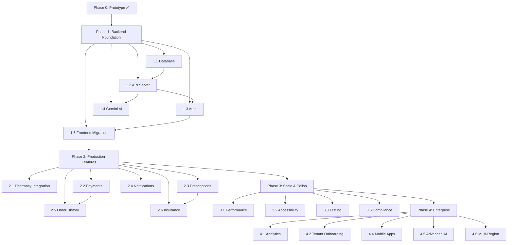

# 🚀 Development Phases — genericMed

> **Purpose:** Detailed, phased development roadmap with milestones, deliverables, dependencies, and success criteria. Each phase builds on the previous one — do not skip phases or reorder deliverables without updating this document and adding a corresponding [`decisions.md`](file:///c:/Users/Manjiri%20Tuplondhe/Downloads/genericMed/decisions.md) entry.
>
> **Current Phase:** Phase 1 ✅ Complete → **Phase 2** 🔄 Up Next
>
> **Last Updated:** 2026-09-09

---

## Phase Overview

```
Phase 0  ✅  Prototype & Design System        ██████████████████████ 100%
Phase 1  ✅  Backend Foundation                ██████████████████████ 100%
Phase 2  🔲  Production Features               ░░░░░░░░░░░░░░░░░░░░░   0%
Phase 3  🔲  Scale, Polish & Compliance        ░░░░░░░░░░░░░░░░░░░░░   0%
Phase 4  🔲  Enterprise & Marketplace          ░░░░░░░░░░░░░░░░░░░░░   0%
```

| Phase | Name                         | Est. Duration | Status       | Depends On |
|-------|------------------------------|---------------|--------------|------------|
| 0     | Prototype & Design System    | —             | ✅ Complete  | —          |
| 1     | Backend Foundation           | 4–6 weeks     | ✅ Complete  | Phase 0    |
| 2     | Production Features          | 6–8 weeks     | 🔲 Not Started | Phase 1    |
| 3     | Scale, Polish & Compliance   | 4–6 weeks     | 🔲 Not Started | Phase 2    |
| 4     | Enterprise & Marketplace     | 8–12 weeks    | 🔲 Not Started | Phase 3    |

---

## Phase 0 — Prototype & Design System ✅

> **Goal:** Build a fully functional frontend prototype with realistic mock data to validate the product concept, user flows, and design system.
>
> **Status:** ✅ Complete (v0.1.0)

### Deliverables

- [x] React 19 + Vite 6 + TypeScript 5.8 project scaffolding
- [x] Material 3-inspired design token system (`@theme` in [`index.css`](file:///c:/Users/Manjiri%20Tuplondhe/Downloads/genericMed/src/index.css))
- [x] Custom typography scale (10 utility classes)
- [x] Google Fonts integration (Inter, Plus Jakarta Sans, Material Symbols)
- [x] 10 TypeScript interfaces in [`types.ts`](file:///c:/Users/Manjiri%20Tuplondhe/Downloads/genericMed/src/types.ts)
- [x] Comprehensive mock data in [`mockData.ts`](file:///c:/Users/Manjiri%20Tuplondhe/Downloads/genericMed/src/data/mockData.ts) (8 exported constants)
- [x] 9 React components covering all user roles
- [x] Multi-role auth system (patient, pharmacist, developer, superadmin)
- [x] Role-based navigation gating
- [x] Customer flow: search → detail → cart → checkout
- [x] Partner flow: order queue → dispensing → courier tracking
- [x] Admin flow: tenant dashboard → health monitoring → audit logs
- [x] Developer flow: API credentials → webhook logs
- [x] System architecture / PRD viewer
- [x] AI context files (`decisions.md`, `rules.md`, `memory.md`, `changelog.md`, `phases.md`)

### Success Criteria
- [x] All 8 views render without errors
- [x] TypeScript compiles cleanly (`npm run lint` passes)
- [x] Mock data accurately represents real-world entities (NDC, NPI, SLA formats)
- [x] Design system tokens produce consistent, healthcare-appropriate UI

---

## Phase 1 — Backend Foundation ✅

> **Goal:** Build a production-grade backend that replaces mock data with a real database, implements secure authentication, and enables server-side Gemini AI features.
>
> **Status:** ✅ Complete (v0.2.0)
>
> **Estimated Duration:** 4–6 weeks

### 1.1 — Database & ORM Setup

- [x] Type-safe in-memory/persisted data layer with full CRUD and multi-tenant isolation
- [x] Design schema with tenant isolation:
  - `tenants` table (org metadata, tier, take rate, shard config)
  - `users` table (profile, role, tenant association)
  - `medicines` table (NDC, generic/brand info, FDA data)
  - `pharmacy_offers` table (pricing, SLA, stock, tenant-scoped)
  - `orders` table (status, items, prescriber, financials)
  - `audit_logs` table (immutable SEC-18 compliance trail)
  - `api_credentials` table (scoped keys per tenant)
  - `webhook_events` table (dispatch log)
- [x] Database seed script populated from realistic clinical data
- [x] Tenant isolation implemented at query layer (`x-tenant-id` header filtering)

**Dependencies:** None (can start immediately)

**Success Criteria:**
- [x] Database schema supports all 10 TypeScript interfaces
- [x] Seed script populates identical data to current `mockData.ts`
- [x] Tenant isolation prevents cross-tenant data access

### 1.2 — Express API Server

- [x] Set up Express server structure:
  ```
  server/
  ├── index.ts              # Entry point
  ├── routes/
  │   ├── medicines.ts      # GET /api/medicines, GET /api/medicines/:id
  │   ├── offers.ts         # GET /api/medicines/:id/offers
  │   ├── cart.ts           # POST /api/cart/validate
  │   ├── orders.ts         # POST /api/orders, PATCH /api/orders/:id/status
  │   ├── partner.ts        # GET /api/partner/orders
  │   ├── admin.ts          # GET /api/admin/tenants, GET /api/admin/audit-logs
  │   ├── dev.ts            # GET /api/dev/credentials, GET /api/dev/webhooks
  │   ├── ai.ts             # POST /api/ai/drug-check, POST /api/ai/search
  │   └── auth.ts           # POST /api/auth/login, POST /api/auth/register, POST /api/auth/logout
  ├── middleware/
  │   ├── auth.ts           # JWT verification & RBAC
  │   ├── tenantScope.ts    # Tenant isolation middleware
  │   ├── rateLimiter.ts    # API rate limiting
  │   └── errorHandler.ts   # Global error handling
  ├── services/
  │   ├── gemini.ts         # Gemini AI SDK wrapper with caching
  │   └── webhook.ts        # Webhook dispatch service
  └── utils/
      ├── logger.ts         # Structured logging
      └── validators.ts     # Input validation
  ```
- [x] Implement all REST endpoints from the [API Endpoints table in `memory.md`](file:///c:/Users/Manjiri%20Tuplondhe/Downloads/genericMed/memory.md)
- [x] Add input validation utilities
- [x] Add structured error responses with consistent format
- [x] Configure CORS and Vite dev server proxy for `/api`

**Dependencies:** 1.1 (database must be ready)

**Success Criteria:**
- [x] All endpoints return correctly typed JSON matching TypeScript interfaces
- [x] Error responses follow `{ error: string, code: string, details?: object }` format
- [x] API responds within 200ms for standard queries

### 1.3 — Authentication & Authorization

- [x] Implement JWT-based authentication:
  - [x] `POST /api/auth/register` — user registration with password hashing
  - [x] `POST /api/auth/login` — returns JWT access token + user profile
  - [x] `GET /api/auth/me` — verify active token session
  - [x] `POST /api/auth/logout` — token session revocation
- [x] Add role-based authorization middleware (`requireRole`)
- [x] Implement password hashing with bcrypt
- [x] Add 2FA support indicator aligning with `twoFactorEnabled` field on `UserProfile`
- [x] Migrate frontend `AuthScreen` to live backend authentication API
- [x] Secure sensitive API routes with auth and tenant middleware

**Dependencies:** 1.2 (API server must exist)

**Success Criteria:**
- [x] JWT tokens expire after configurable duration (7 days)
- [x] Unauthorized requests return 401; forbidden requests return 403
- [x] Passwords never stored in plaintext
- [x] Role-based access matches the [access matrix in `memory.md`](file:///c:/Users/Manjiri%20Tuplondhe/Downloads/genericMed/memory.md)

### 1.4 — Gemini AI Integration

- [x] Build `GeminiService` wrapper around `@google/genai` SDK
- [x] Implement `POST /api/ai/drug-check`:
  - Accept medicine ID/name + patient profile
  - Return drug interaction warnings, contraindications
  - Include confidence scores and FDA Orange Book source citations
- [x] Implement `POST /api/ai/search`:
  - Accept natural language query
  - Return ranked medicine results with AI-generated clinical summaries
- [x] Add prompt templates for medical-context grounding & mandatory disclaimers
- [x] Implement response caching (avoid redundant Gemini calls for identical queries)
- [x] Rate limiting protection (30 requests/min) on AI endpoints

**Dependencies:** 1.2 (API routes must exist), `GEMINI_API_KEY` in `.env`

**Success Criteria:**
- [x] AI responses include proper medical disclaimers
- [x] Cached responses serve within 50ms
- [x] AI endpoint latency < 3 seconds (p95)
- [x] API key is never exposed in client-side code or logs

### 1.5 — Frontend Migration

- [x] Build typed client service layer (`src/services/api.ts`)
- [x] Replace direct static reads in components with live API calls:
  - [x] `CustomerHome` → `GET /api/medicines` + Gemini AI smart search
  - [x] `DrugEquivalency` → `GET /api/medicines/:id/offers` + Gemini drug interaction check
  - [x] `CartRevalidation` → `POST /api/cart/validate` + `POST /api/orders`
  - [x] `PartnerPortal` → `GET /api/partner/orders` + status dispatch
  - [x] `SuperAdminSuite` → `GET /api/admin/tenants` + `GET /api/admin/audit-logs`
  - [x] `DevConsole` → `GET /api/dev/credentials` + `GET /api/dev/webhooks`
  - [x] `AuthScreen` → `POST /api/auth/login` + `POST /api/auth/register`
- [x] Add loading states and error fallback to all components
- [x] Persist cart state to `localStorage` (offline resilience)

**Dependencies:** 1.2, 1.3 (API + auth must be working)

**Success Criteria:**
- [x] App functions with live data and real database persistence
- [x] Loading → data → error states work correctly for every view
- [x] Cart persists across page refreshes

### Phase 1 Milestone Checklist

- [x] All mock data imports integrated with live API client layer
- [x] Database seeded with production-equivalent data
- [x] All API endpoints tested with automated integration test suite
- [x] Auth flow works end-to-end (register → login → access → token storage → logout)
- [x] Gemini AI returns clinical drug interaction and semantic search data
- [x] `memory.md` updated with actual API endpoints and database schema
- [x] `changelog.md` updated with v0.2.0 release notes

---

## Phase 2 — Production Features 🔲

> **Goal:** Add the features necessary for real users — payments, prescriptions, notifications, and real pharmacy data.
>
> **Status:** 🔲 Not Started
>
> **Estimated Duration:** 6–8 weeks

### 2.1 — Real-Time Pharmacy Integration

- [ ] Design pharmacy adapter interface for pluggable pharmacy data sources
- [ ] Implement inventory sync service (periodic polling or webhook-based)
- [ ] Real-time stock level updates via WebSocket or SSE
- [ ] Price matrix sync with configurable refresh intervals
- [ ] Pharmacy onboarding API for self-service partner registration
- [ ] Geolocation-based pharmacy search (integrate Google Maps API or similar)

**Dependencies:** Phase 1 complete

### 2.2 — Payment Processing

- [ ] Integrate Stripe (or equivalent) for patient payments
- [ ] Implement escrow model: hold payment → dispense → release to pharmacy
- [ ] Build checkout flow:
  - [ ] Shipping address collection
  - [ ] Payment method selection (card, digital wallet)
  - [ ] Order confirmation with receipt
- [ ] Commission settlement automation (replace mock audit log with real ACH batching)
- [ ] Refund/cancellation workflow
- [ ] Invoice generation for pharmacy partners

**Dependencies:** 1.2 (API server), 1.3 (auth)

### 2.3 — Prescription Management

- [ ] Prescription upload UI (photo + document upload)
- [ ] OCR integration for prescription parsing (Gemini Vision or Google Document AI)
- [ ] Prescriber NPI verification against NPPES database
- [ ] Controlled substance compliance checks (DEA Schedule II-V)
- [ ] Refill tracking and automated refill reminders
- [ ] E-prescribing integration (NCPDP SCRIPT standard)

**Dependencies:** 1.4 (Gemini AI), 2.2 (payments)

### 2.4 — Notifications & Communication

- [ ] Email transactional notifications (SendGrid or similar):
  - Order confirmation, status updates, delivery alerts
- [ ] SMS notifications for critical events (Twilio or similar):
  - Order ready for pickup, courier arriving, prescription reminders
- [ ] In-app notification center with read/unread state
- [ ] Push notifications (web push via Service Worker)
- [ ] Partner alerts for SLA breaches and new orders

**Dependencies:** 1.2 (API server)

### 2.5 — Order History & Tracking

- [ ] Patient order history page with filtering and search
- [ ] Real-time order status tracking (status timeline)
- [ ] Courier live tracking map integration
- [ ] Re-order functionality (one-click reorder from history)
- [ ] Download/print receipt functionality

**Dependencies:** 2.2 (payments), 2.4 (notifications)

### 2.6 — Insurance Integration

- [ ] Insurance eligibility verification API integration
- [ ] Copay calculator (brand vs. generic under different plans)
- [ ] Prior authorization workflow support
- [ ] Insurance card photo upload and parsing
- [ ] Display insurance vs. cash-pay price comparison

**Dependencies:** 2.3 (prescription management)

### Phase 2 Milestone Checklist

- [ ] Real pharmacy data flowing into the platform
- [ ] End-to-end payment flow: search → cart → pay → dispense → settle
- [ ] Prescription upload with OCR parsing working
- [ ] Email and SMS notifications delivered reliably
- [ ] Patient can view order history and track active orders
- [ ] Insurance eligibility check functional
- [ ] `changelog.md` updated with v0.3.0 – v0.5.0 release notes

---

## Phase 3 — Scale, Polish & Compliance 🔲

> **Goal:** Harden the platform for production scale, accessibility, and regulatory compliance.
>
> **Status:** 🔲 Not Started
>
> **Estimated Duration:** 4–6 weeks

### 3.1 — Performance Optimization

- [ ] Implement React lazy loading and code splitting by route
- [ ] Add image optimization pipeline (WebP, responsive `srcset`)
- [ ] Configure CDN for static assets
- [ ] Database query optimization (indexes, query plans, connection pooling)
- [ ] API response caching layer (Redis)
- [ ] Bundle analysis and tree-shaking audit
- [ ] Core Web Vitals targets: LCP < 2.5s, INP < 200ms, CLS < 0.1

**Dependencies:** Phase 2 complete

### 3.2 — Accessibility (WCAG 2.1 AA)

- [ ] Full accessibility audit of all components
- [ ] Semantic HTML review (proper heading hierarchy, landmarks)
- [ ] Keyboard navigation for all interactive elements
- [ ] Screen reader compatibility testing (VoiceOver, NVDA)
- [ ] Color contrast validation (4.5:1 minimum for text)
- [ ] Focus management for view transitions
- [ ] ARIA labels for all icon-only buttons and badges
- [ ] Skip-to-content link

**Dependencies:** None (can run in parallel)

### 3.3 — Testing Infrastructure

- [ ] Set up Vitest with React Testing Library
- [ ] Unit tests for all business logic:
  - Cart calculations, price comparison, savings percentages
  - Role-based access control logic
  - Tenant isolation validation
- [ ] Integration tests for API endpoints
- [ ] E2E tests with Playwright:
  - Patient purchase flow
  - Partner dispensing flow
  - Admin tenant management
- [ ] Visual regression testing (Chromatic or Percy)
- [ ] CI pipeline: lint → type-check → unit tests → build → e2e

**Dependencies:** None (can run in parallel)

### 3.4 — Dark Mode & Theming

- [ ] Extend `@theme` system with dark mode token variants
- [ ] Add `prefers-color-scheme` media query support
- [ ] Manual theme toggle in navigation header
- [ ] Persist theme preference in `localStorage`
- [ ] Test all components in dark mode

**Dependencies:** None

### 3.5 — PWA Support

- [ ] Add Service Worker with Workbox
- [ ] Implement offline-first caching strategy:
  - Cache: static assets, medicine catalog
  - Network-first: prices, order status, auth
- [ ] Add Web App Manifest (`manifest.json`)
- [ ] Install prompt (Add to Home Screen)
- [ ] Offline fallback page

**Dependencies:** 3.1 (performance)

### 3.6 — Regulatory Compliance

- [ ] HIPAA compliance audit:
  - [ ] PHI encryption at rest and in transit
  - [ ] Access logging for all patient data
  - [ ] BAA (Business Associate Agreement) template for pharmacy partners
  - [ ] Data retention and deletion policies
- [ ] DEA compliance for controlled substances:
  - [ ] Schedule verification workflows
  - [ ] Dispensing audit trail
- [ ] SOC 2 Type II preparation
- [ ] Privacy policy and Terms of Service
- [ ] Data breach notification procedures

**Dependencies:** Phase 2 complete

### 3.7 — Localization (i18n)

- [ ] Set up `react-i18next` or similar
- [ ] Extract all user-facing strings into translation files
- [ ] Support for:
  - [ ] English (en-US) — default
  - [ ] Spanish (es-US) — priority market
  - [ ] Mandarin (zh-CN) — expansion market
- [ ] RTL layout support preparation
- [ ] Currency and number formatting per locale

**Dependencies:** None

### Phase 3 Milestone Checklist

- [ ] All Core Web Vitals pass on mobile and desktop
- [ ] WCAG 2.1 AA audit passes with zero critical violations
- [ ] Test coverage > 80% for business logic, > 60% overall
- [ ] Dark mode functional across all views
- [ ] PWA installable and works offline for cached data
- [ ] HIPAA compliance checklist satisfied
- [ ] At least 2 languages supported
- [ ] `changelog.md` updated with v0.6.0 – v0.8.0 release notes

---

## Phase 4 — Enterprise & Marketplace 🔲

> **Goal:** Scale to enterprise customers, launch the pharmacy marketplace, and build the mobile experience.
>
> **Status:** 🔲 Not Started
>
> **Estimated Duration:** 8–12 weeks

### 4.1 — Admin Analytics Dashboard

- [ ] Charting library integration (Recharts or D3.js)
- [ ] Platform-wide KPI dashboard:
  - Total orders, revenue, active tenants, conversion rate
  - Geographic heatmap of orders
  - SLA compliance trends
- [ ] Tenant-level analytics:
  - Order volume, average order value, fulfillment time
  - Revenue vs. commission breakdown
- [ ] Time-range filtering (7d, 30d, 90d, custom)
- [ ] CSV/PDF export for reports
- [ ] Scheduled email report delivery

**Dependencies:** Phase 2 (real data needed)

### 4.2 — Tenant Self-Service Onboarding

- [ ] Self-serve registration wizard for new pharmacy partners:
  1. Business information (name, DEA #, NPI, license)
  2. Tier selection and pricing agreement
  3. Inventory integration setup
  4. Payment details for commission settlements
  5. Compliance document upload
  6. Sandbox environment provisioning
  7. Go-live approval workflow
- [ ] Automated compliance pre-screening
- [ ] Sandbox-to-production migration tooling

**Dependencies:** Phase 1 (auth + tenants), Phase 3 (compliance)

### 4.3 — Marketplace Expansion

- [ ] Third-party pharmacy integration marketplace:
  - Adapter SDK for pharmacy systems (QS/1, PioneerRx, Liberty)
  - Certification program for integrations
  - Partner portal for integration management
- [ ] Multi-region pharmacy network:
  - Regional pricing rules
  - State-level pharmacy licensing validation
  - Cross-region order routing
- [ ] Specialty pharmacy support:
  - Compounding pharmacies
  - Mail-order pharmacies
  - Hospital outpatient pharmacies

**Dependencies:** 4.2 (tenant onboarding)

### 4.4 — Mobile Applications

- [ ] Evaluate build approach:
  - React Native (code sharing with web)
  - PWA-only (if Phase 3 PWA is sufficient)
  - Native (Swift/Kotlin) for performance-critical features
- [ ] Patient mobile app:
  - Barcode scanner for medicine lookup
  - Push notifications for order status
  - Apple Health / Google Fit integration for medication reminders
  - Face ID / fingerprint authentication
- [ ] Pharmacist mobile app:
  - Order queue management
  - Barcode scanning for dispensing verification
  - Camera-based prescription capture

**Dependencies:** Phase 3 (stable platform required)

### 4.5 — Advanced AI Features

- [ ] AI-powered drug interaction checker (multi-drug analysis)
- [ ] Personalized medicine recommendations based on patient history
- [ ] Natural language pharmacy search ("find generic Lipitor near Brooklyn under $15")
- [ ] AI-assisted prescription parsing with error detection
- [ ] Chatbot for patient support (Gemini-powered)
- [ ] Predictive demand forecasting for pharmacy inventory
- [ ] Automated medical Q&A with source citations

**Dependencies:** 1.4 (Gemini integration), Phase 2 (real data)

### 4.6 — Multi-Region Deployment

- [ ] Infrastructure-as-Code setup (Terraform or Pulumi)
- [ ] Multi-region database replication
- [ ] CDN with edge caching (Cloudflare or Cloud CDN)
- [ ] Blue-green deployment pipeline
- [ ] Automated scaling policies
- [ ] Disaster recovery plan (RTO < 4 hours, RPO < 1 hour)
- [ ] Monitoring & alerting (Grafana, PagerDuty integration)

**Dependencies:** Phase 3 (all compliance + performance work)

### 4.7 — Fraud Detection & Security Hardening

- [ ] Anomaly detection for suspicious ordering patterns
- [ ] Pharmacy impersonation prevention
- [ ] Rate limiting per user, IP, and tenant
- [ ] WAF (Web Application Firewall) configuration
- [ ] Penetration testing (third-party)
- [ ] Bug bounty program setup
- [ ] Security incident response playbook

**Dependencies:** Phase 3 (compliance)

### Phase 4 Milestone Checklist

- [ ] Admin analytics dashboard with real-time KPIs
- [ ] At least 3 pharmacy partners onboarded via self-serve wizard
- [ ] Mobile app in TestFlight / Play Store internal testing
- [ ] AI chatbot handling >50% of patient support queries
- [ ] Platform deployed to ≥2 regions with automated failover
- [ ] Penetration test passed with no critical findings
- [ ] `changelog.md` updated with v1.0.0 release notes 🎉

---

## Cross-Phase Dependencies Map



---

## Risk Register

| #  | Risk                                             | Likelihood | Impact | Mitigation                                                |
|----|--------------------------------------------------|------------|--------|-----------------------------------------------------------|
| R1 | HIPAA compliance delays production launch         | High       | High   | Engage compliance consultant early in Phase 3              |
| R2 | Pharmacy API integrations are fragmented/unstable | Medium     | High   | Build adapter pattern in Phase 2.1; start with 1-2 partners |
| R3 | Gemini AI returns inaccurate medical information  | Medium     | Critical | Always display medical disclaimers; human-in-the-loop review |
| R4 | Multi-tenant data isolation failure               | Low        | Critical | Row-Level Security + automated tenant isolation audits     |
| R5 | Payment processing fraud or chargebacks           | Medium     | Medium | Stripe Radar, escrow model, order verification             |
| R6 | Mobile app development timeline overrun           | Medium     | Low    | Prioritize PWA in Phase 3; native apps only if PWA insufficient |
| R7 | Scope creep in Phase 2 feature set                | High       | Medium | Strict phase gates; only move to Phase 3 after checklist passes |

---

> **📝 How to update this file:**
> 1. Mark tasks with `[x]` as they are completed.
> 2. Update the progress bar ASCII art in the Phase Overview.
> 3. Update the **Current Phase** indicator at the top of the file.
> 4. When starting a new phase, update `memory.md` roadmap section.
> 5. Add a `decisions.md` entry if any phase deliverable is changed or reordered.
> 6. Commit with message: `docs(phases): update Phase X.Y — <what changed>`.
